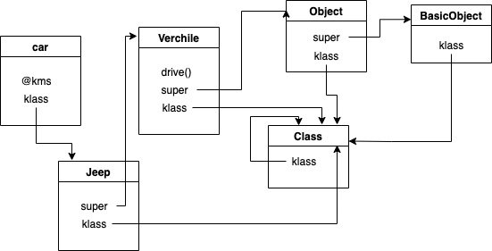

# What is Class in Ruby

* Everything in ruby are objects
* A class object is not a instance of its superclass. In fact, all class in ruby are instances of the `Class` class 
    ```ruby
    Object.class # => Class 
    
    class A; end 
    A.class # => Class 
    ``` 
* By default, all classes are inherit from `Object` class
    ```ruby
    class A; end
    A.superclass # => Object 
    ```       
---
* Conceptually, Ruby objects consists of the following: 
    * A pointer to the object's immediate class, named `klass`
    * A pointer to the next class in inheritance chain, named `super`  
    * A hash table of instance variables 
    * A set of flags, used by MRI 
      * `Singleton` is set on objects that are `meta class` 
      * `Mark` and `Finalize` are used for garbage collector 
      * `Exivar` is used for built in classes 
      * `Freeze` prevents objects from being modified     
    * Note: built-in classes, eg: `Class`, `Float` are not really Ruby objects. They don't have instance variables. Instead they have a fixed structure.
* To find out which method implementation is called for any object, you go "out and up". That is, you find the objects "klass", and then follow the "super" chain up until you find a matching method. 
* If I have the following class definition         
    ```ruby
    class Vehicle
      def initialize(kms)
        @kms = kms
      end
      def drive
        puts "let's go!"
      end
    end
  
    class Jeep < Vehicle
    end
  
    car = Jeep.new(20)
    car.drive
    ```
   Here is how ruby representing the class `Jeep`, `Vehicle` and it's instance `car` in memory 
    
---
* `superclass` v.s. `ancestor` 
  * `superclass` 
    * return the inheritance chain of the class 
    * Every class in Ruby has a single superclass except `BasicObject`    
  * `ancestor` 
    * Will include list of modules include in inheritance chain 
      ```
      class Order; end
      Order.ancestors # => [Order, Object, Kernel, BasicObject]  
      Order.superclass # => Object 
      Order.superclass.super_class # => BasicObject
      Order.superclass.included_modules # => kernel 
      ```
  
---
