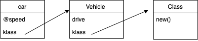
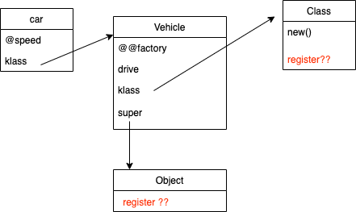
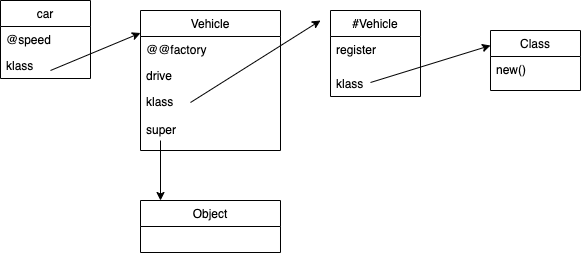
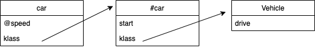
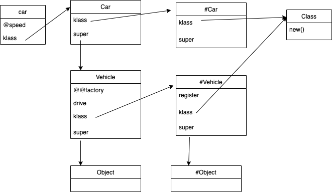
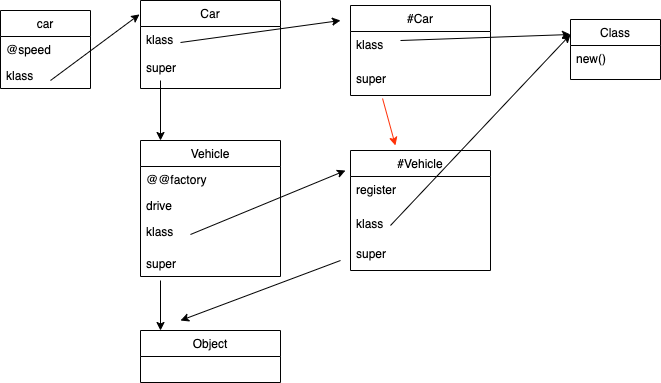

# What is Singleton Class in Ruby

It has many names: metaclass, engenclass, singleton class 

---
## Why we need Singleton Class 
It solve the `method dispatching` problem for Ruby compiler 

Assuming we have the following `Vehicle` class  
```Ruby
class Vehicle 
  def initialize(speed)
    @speed = speed
  end 

  def drive
    puts 'drive'
  end
end

car = Vehicle.new(25)
car.drive 
```

In memory, ruby present it like 



Noe let's assume, to find out which method implementation is called for any object, ruby will just follow the klass pointer. 

When you call `car.drive`, you compiler will just find the klass of your `car` instance, which is `Verchile`, and find `drive` method there. It works

But what if we make the `Vehicle` a bit more complicated 

```Ruby
class Vehicle 
  @@factory = []

  def self.register(vehicle) 
    factory << vehicle 
  end
  
  def initialize(speed)
    @speed = speed
  end 

  def drive
    puts 'drive'
  end
end

car = Vehicle.new(25)
Vehicle.register(car) 
```

How would ruby represent that in memory ?  


--- 
## Discover Singleton class 
Singleton class solved this problem. From now, I will represent the singleton class of class `A` as `#A`, singleton class of instance `b` as `#b`.

When you do `def self.register`, Ruby acutally open the singleton class of `Vehicle`, and add the `register` method there. 



Now when you do `Vehicle.register(car) `, follow the `klass` pointer, you will be able to find the `register` method implementation.
Same rule works for `Vehicle.new`. We are done here (sorry this is a lie, we will see it a bit later) 

Just want to share something interesting fact before we move on: 
* Singleton class is created only when needed
* You can use `singleton_class` method to get the singleton_class of a class  
* The `class` of `singleton_class` is also `Class` 

---
## Singleton class for instance 

The same rule apply for instances
```
car = Vehicle.new(25)
def car.start
  puts 'start'
end
```

In memory, ruby represent it like this: 



---
## The turth about Singleton Class 

Now let's look at a more complicated Vehicle example 
```Ruby
class Vehicle 
  @@factory = []
  
  def self.register(vehicle)
    @@factory << vehicle
  end
  
  def initialize(speed)
    @speed = speed
  end 

  def drive
    puts 'drive'
  end
end

class Car < Vehicle 
  def self.register(car)
    super
  end  
end 

car = Car.new(25)
Car.register(car)  
```

How would ruby reprensent that in memory ? 


Now just follow the `klass` pointer, `Car` can never find the `register` method. There must be a bridge between `#Car` and `#Vehicle` 

Here is the bridge ! 



The truth: **To find out which method implementation is called for any object, you go "out and up". That is, you find the objects "klass", and then follow the "super" china up until you find a matching method**

Quick Proof 
```
class A
  def self.say_hi; end
end 

class B < A
  def self.say_hi
    super
  end
end

B.super # => A
B.singleton_class.superclass # => #<Class:A>
A.singleton_class.super_class # => #<Class:Object> 
```

---
## Alternative syntaxes 

We can use `class << ` syntax to open singleton class and add method to it 

```Ruby 
car = Vehicle.new(2000)
class << car  
  def start
    "starting..."
  end
end
```

We are using this pattern when define class methods in a class 
```
class A
  class << self  # self is A 
    def class_method_1 ; end
  end
end
```

Another way is using `extend`. When you do `self.extend(some_module)`, what it actually doing is open the singletone class of `self`, and append methods from module to it. 

  
